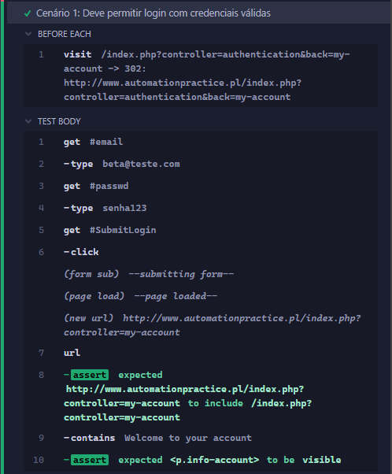
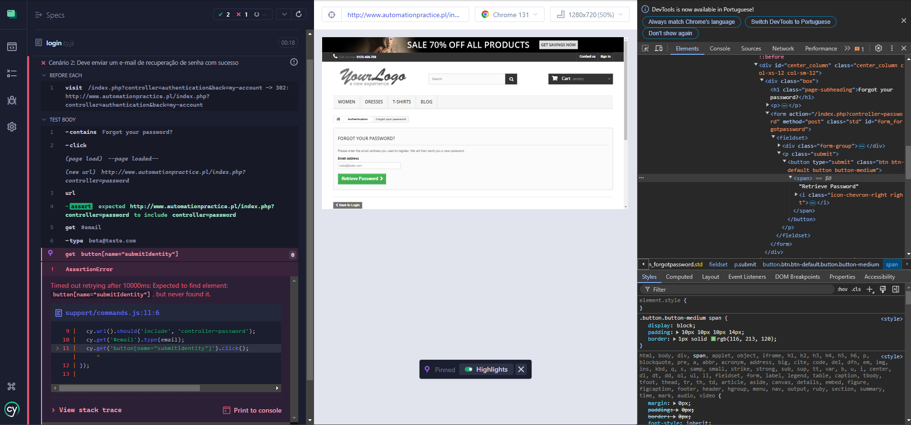
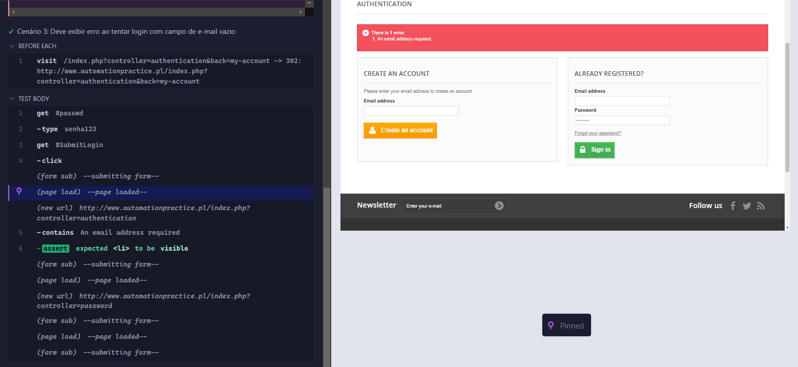

# <div align="center"> 🚀 DESAFIO TÉCNICO (ESTÁGIO) – QUALITY ASSURANCE ENGINEER </div>

Este repositório contém a automação dos cenários de teste solicitados para o desafio técnico de QA, utilizando a página de login do site Automation Practice.

---

## 📝 Descrição do Projeto

O objetivo deste desafio é criar 3 cenários de teste automatizados interagindo com os elementos na página de login do site **Automation Practice**, utilizando o framework **Cypress**.

Os testes foram desenvolvidos seguindo as melhores práticas de automação e organizados para fácil execução e manutenção.

---

## 🛠️ Tecnologias Utilizadas

- **Framework**: Cypress
- **Linguagem de Programação**: JavaScript
- **IDE**: Visual Studio Code
- **Testes Automatizados**: 3 cenários básicos cobrindo funcionalidades da página de login

---

## 📂 Estrutura do Projeto

Abaixo está a estrutura principal deste repositório:

```bash
desafioDTI/
├── cypress/
│   ├── e2e/                 # Testes End-to-End
│   │   ├── login.cy.js      # Cenários de teste para a página de login
│   │   └── ...
│   ├── fixtures/            # Dados utilizados nos testes
│   ├── support/             # Configurações e comandos customizados
│   └── ...
├── cypress.config.js        # Configuração do Cypress
├── package.json             # Dependências do projeto
├── README.md                # Documentação do projeto
└── ...

```

---

## 🔧 Pré-requisitos

Antes de começar, você precisará ter instalado em sua máquina:

- [Node.js](https://nodejs.org/) (versão LTS recomendada)
- [Git](https://git-scm.com/)
- Cypress (instalado através do `npm` ou `yarn`)

---

## 🚀 Como Rodar os Testes

### Passo 1: Clone o Repositório

```bash
git clone https://github.com/betaniasilva/desafioDTI.git
cd desafioDTI/cypress

```

### Passo 2: Instale as Dependências

Execute o comando abaixo para instalar todas as dependências necessárias:

```bash
npm install

```

### Passo 3: Abra o Cypress

Para abrir o Cypress e executar os testes interativamente:

```bash
npx cypress open

```

Selecione o navegador de sua preferência e clique no arquivo de teste para executá-lo.

### Passo 4: Execute os Testes no Terminal (opcional)

Se preferir executar os testes diretamente no terminal, use:

```bash
npx cypress run

```

---

## 📋 Cenários de Teste

### **Cenário 1️⃣: Verificar se um usuário autenticado consegue fazer login com exito**

**Objetivo:** Garantir que um usuário com credenciais corretas consiga acessar sua conta.

- **Dado que** o usuário esteja na página de login do site "Automation Practice",
- **Quando** o usuário preencher o campo de e-mail com um endereço válido, o campo de senha com a senha correta e clicar no botão de login,
- **Então** ele deve ser redirecionado para a página "Minha Conta" e visualizar a mensagem "Welcome to your account".

---

### **Cenário 2️⃣: Verificar se a recuperação de senha funciona como esperado**

**Objetivo:** Verificar se a funcionalidade de recuperação de senha funciona corretamente.

- **Dado que** o usuário esteja na página de login do site "Automation Practice",
- **Quando** o usuário clicar no link "Forgot your password?" e inserir um e-mail válido no campo de recuperação de senha,
- **Então** o site deve exibir uma mensagem informando que o e-mail para redefinição de senha foi enviado com sucesso.

---

### **Cenário 3️⃣: Verificar comportamento do site ao tentar login com campo de e-mail vazio**

**Objetivo:** Validar a mensagem de erro ao tentar enviar o formulário de login sem preencher o campo de e-mail.

- **Dado que** o usuário esteja na página de login do site "Automation Practice",
- **Quando** o usuário deixar o campo de e-mail vazio, preencher o campo de senha e clicar no botão de login,
- **Então** o sistema deve exibir uma mensagem de erro informando "An email address required".

<br/>

## 🧪 Resultado dos testes

### **Cenário 1️⃣:**



### **Cenário 2️⃣:**



Durante os testes automatizados da funcionalidade de recuperação de senha no site Automation Practice, foi identificado que o botão "Retrieve Password" está aninhado dentro de um elemento "p".

**Essa estrutura não é semanticamente correta em HTML, pois:**

O "p" é usado para representar parágrafos de texto, e não para agrupar elementos interativos.
Isso causa problemas para ferramentas de automação de testes e leitores de tela, que podem interpretar a estrutura de forma errada.
Elementos interativos, como "button", devem ser colocados dentro de contêineres adequados como "div", ou simplesmente ser utilizados sozinhos.
Esse problema resultou em falhas nos testes automatizados porque o Cypress não conseguiu encontrar o botão usando o seletor definido.

---

Nesse caso eu poderia ter usado uma solução temporaria para conseguir executar o teste, utilizando "cy.get('p.submit button[type="submit"]').click();", porém o papel do QA é de encontrar defeitos para serem corrigidos, eu estaria apenas mascarando um problema, o ideal seria que a estrutura HTML seja ajustada para atender às boas práticas de semântica. Nesse caso, eu abriria um bug report, com todos os detalhes do bug encontrado. 


### **Cenário 3️⃣:**



<br/>


# 📱 Sobre o autor

<br/>

<a href="https://gitlab.com/betaniaamaral"></a>

<br/>

**🌼 Meu nome é Betânia Amaral**

**🏫 Faculdade: UniSenac Pelotas**

**🖥 Curso: Análise e Desenvolvimento de Sistemas - 4º SEMESTRE**

**🏙 Onde habita: Pelotas - Rio Grande do Sul**

Instagram - [@la_bett](https://www.instagram.com/la_bett/)

Twitch - [cherfps](https://www.twitch.tv/cherfps)

Linkedin - [@betania-amaral](https://www.linkedin.com/in/bet%C3%A2nia-amaral-321960285/)

Gitlab - [betaniaAmaral](https://gitlab.com/betaniaAmaral)

<br/>